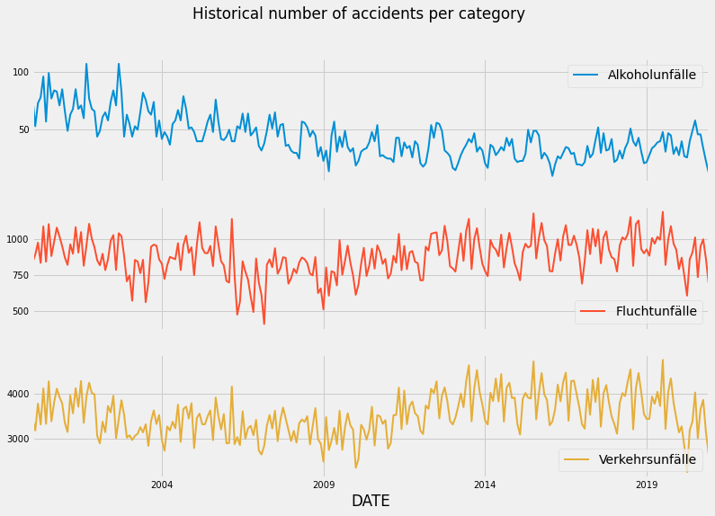
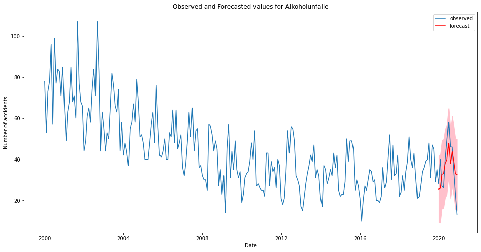

# DPS-Challenge

The project is submitted for a challenfe for the Digital Product School (DPS). In the project a dataframe consisting of historical values of the accidents from different categories in the city of Munich, Germany.

The following are the outcomes of the project:
 - Cleaning the data, then visualizing the historical accidents from the dataframe
 - Training a model to forecast future values.
 - Deploying the model with an endpoint that accepts POST requests in JSON body.

### Files

 - **Preprocessing and Visualization.ipynp**: A jupyter notebook contains a step-by-step of importing the data, cleaning, and then visualizing the results
 - **Training Models.ipynp**: A jupyter notebook that loads the preprocessed data, then estimating the parameters passed for the forecasting algorithm "SARIMA". The model is trained and tested on the year 2020 data, the model is then evaluated and exported for deployment.
 - **inference.py & endpoint.py**: Two scripts, in order, the former contains the class which performs the  forecasting and returns the result. The latter is the endpoint, which is deployed.
 - **test.py**: a script to test the requests to the endpoint.

## Outcomes
### Visualizing historical data:
The below image, is the historical visualization of the accidents per category, starting from the year 2000 up to 2020.
  
  
 More visualization representing the trend and seasonality can be previewed in the Visualization notebook.
 ### Model training and forecasting:
 The **SARIMA** forecasting algorithm was used, as the data as deduced from the graphs has seasonality and trend, which can be tackled by the ARIMA model.
 The data available are from the year 2000 till the end of 2020, the first step was estimating the values for the hyper-parameters for the model. A step-bystep explanation can be found in the notebook.
 
 An example of the forecasting testing on the accidents caused by alcohol in the image below:
   

The model is the fitted on the whole dataframe, and exported for the final part.

### Deploying the model:
The model is deployed on AWS server using FLASK and WSGI web server.
The model accepts POST requests in JSON body format containing the year and the month (must be after 2021), and returns a forecast of the requested month (The sum of the forecasting for each category).

The test.py file can be used to return outputs from the endpoint.